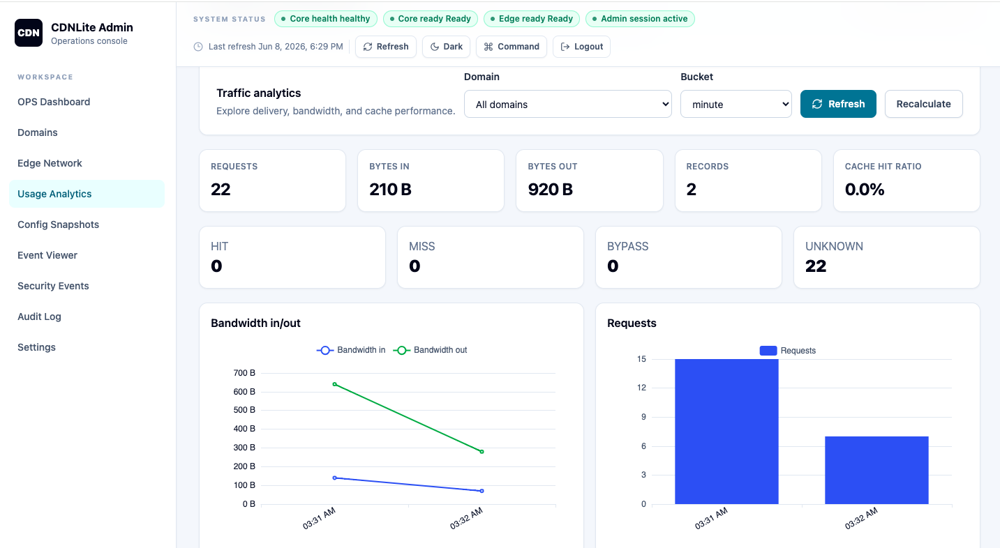

# CDNLite

[](https://github.com/vaheed/CDNLite/actions/workflows/ci.yml)
[](https://github.com/vaheed/CDNLite/tags)
[](docs/)
[](docker-compose.yml)
[](https://github.com/vaheed/CDNLite/pkgs/container/cdnlite-core)

CDNLite is a lightweight modular CDN platform with a PHP control plane, PostgreSQL database, OpenResty/Lua edge proxy, and shell-based edge agent.

It manages domains, DNS records, edge nodes, config snapshots, edge usage ingest, and usage summaries. It is useful for first-time CDN learners, developers testing CDN workflows, operators running a small local stack, maintainers, and agents working in this repository.

## Key Features

- Domain lifecycle API and CLI.
- Domain-scoped DNS records with create, update, list, delete, and optional PowerDNS sync.
- Cloudflare-style per-record controls: proxy on/off and Standard DNS or Geo DNS routing.
- Host-based OpenResty edge proxy using a JSON config snapshot.
- Edge agent registration, heartbeat, config pull, metrics push, and security-event push.
- Automatic edge public IPv4 discovery with platform-owned PowerDNS edge-zone routing.
- Edge-authenticated endpoints using bearer token, edge ID, timestamp, nonce, and HMAC signature.
- Usage ingest with optional idempotency key, stale-domain filtering, and minute/hour/day aggregate rebuilds.
- Global and per-domain usage analytics with bandwidth, request, and cache-effectiveness charts.
- Aggregate overview metrics and actionable warnings with Markdown report export in the dashboard.
- Nameserver-first domain onboarding with delegation verification and lazy PowerDNS zone provisioning.
- Client-only Vue admin dashboard with tab-scoped session persistence for operations, domain management, troubleshooting, and edge developer tools.
- Docker Compose local stack and CI smoke/e2e scripts.

## Screenshot



## Architecture Summary

`core/` is the control plane. It serves HTTP from `core/public_index.php`, registers CLI commands in `core/artisan`, stores data in PostgreSQL, builds edge config, and ingests usage and security events. `edge/openresty/` is the data plane. It reads `/var/lib/cdnlite/config.json`, routes by `Host`, proxies to origins, and writes metrics and security decisions. `edge/agent/` signs calls to core and keeps the edge registered, configured, and reporting runtime queues.

Administrative operations APIs include paginated global security event search at `/api/v1/security/events`, threat summaries at `/api/v1/security/summary`, and audit history at `/api/v1/audit`.
Config operations under `/api/v1/config/snapshots` list and inspect stored versions, compare JSON paths, activate a previous snapshot for edge pulls, and rebuild from current database state.
Origin operations under `/api/v1/domains/{domainId}/origins` manage primary and backup origins, expose manual health checks, and feed readiness warnings plus edge backup retry config.

## Services And Ports

| Service | Compose name | Container port | Host port default | Purpose |
|---|---|---:|---:|---|
| PostgreSQL | `postgres` | `5432` | `5432` | Persistent state. |
| Core API | `core` | `8080` | `8080` | PHP API and CLI runtime. |
| Origin health scheduler | `origin-health-scheduler` | none | none | Runs due origin checks every 30 seconds. |
| Edge proxy | `edge` | `8081` | `8081` | OpenResty proxy. |
| Edge agent | `edge-agent` | none | none | Background sync loop. |
| Admin dashboard | `dashboard` | `80` | `8082` | Static Vue operations dashboard. |

## Quick Start

```bash
cp .env.dev.example .env
docker compose up --build
```

Health checks:

```bash
curl -s http://localhost:8080/health
curl -s http://localhost:8080/cdn-health
curl -s http://localhost:8081/health
curl -s -H "Authorization: Bearer $CDNLITE_API_TOKEN" http://localhost:8080/api/v1/readiness
```

Example output:

```json
{"ok":true,"time":1710000000}
```

Edge health returns:

```json
{"ok":true}
```

Register the local edge token:

```bash
docker compose exec core php artisan cdn:edge:register-token \
  --edge_id=edge-local-1 \
  --token=edge-dev-token
```

For clean resets (`docker compose down -v`) you can enable automatic bootstrap so the edge re-registers without manual token setup:

```bash
# in .env
CDNLITE_BOOTSTRAP_EDGE_TOKEN=1
```

Then restart:

```bash
docker compose down -v
docker compose up -d --build
```

Production recommendation:

1. Set `CDNLITE_BOOTSTRAP_EDGE_TOKEN=0`.
2. Provision per-edge tokens with `cdn:edge:register-token`.
3. Rotate tokens regularly with `cdn:edge:rotate-token`.

## Dashboard Access

The official admin dashboard is served by the `dashboard` Compose service:

- `http://localhost:8082`

The dashboard is a static Vite SPA built from `dash/`. Its `VITE_*` configuration is compiled at image build time, so use browser-reachable URLs such as `http://localhost:8080` and `http://localhost:8081`, not internal Compose hostnames.

When opening the dashboard from another machine, set `VITE_CDNLITE_CORE_URL` and `VITE_CDNLITE_EDGE_URL` to that server's browser-reachable host/IP before rebuilding the dashboard image, and include the dashboard origin in `CDNLITE_CORS_ALLOWED_ORIGINS`. For example: `VITE_CDNLITE_CORE_URL=http://185.1.2.3:8080`, `VITE_CDNLITE_EDGE_URL=http://185.1.2.3:8081`, and `CDNLITE_CORS_ALLOWED_ORIGINS=http://185.1.2.3:8082`.

Local quickstart enables `CDNLITE_BOOTSTRAP_ADMIN_USER=1`, which creates or updates a dashboard admin when core starts. The default dev credentials are:

- Username: `admin`
- Password: `admin`

For a deliberate admin account, or when bootstrap is disabled, create the first dashboard admin user from the core container:

```bash
docker compose exec core php artisan cdn:admin:create \
  --username=admin \
  --password='replace-with-a-long-password'
```

The SPA logs in with `/api/v1/admin/login` and stores the returned bearer session token in browser memory only. The removed server-rendered `/dashboard/*` backend routes now return JSON `404`.

The responsive operations console provides filtered event lists with on-demand raw details and structured health/readiness status in the top bar. A failed browser request is reported as unknown rather than as a confirmed service failure.

Production security note: set `CDNLITE_BOOTSTRAP_ADMIN_USER=0`, replace any local bootstrap credentials, and place the dashboard and CDNLite API behind real authentication at the reverse proxy or platform level. The SPA stores only its session token in tab-scoped `sessionStorage`; admin passwords are never stored. It does not implement production RBAC, and edge developer tokens are kept in session memory only.

## Environment Templates

- `.env.example`: local quickstart defaults.
- `.env.dev.example`: explicit local development defaults, including `admin` / `admin`.
- `.env.production.example`: production-oriented defaults with bootstrap admin disabled and secret placeholders.
- `dash/.env.example`: dashboard-only Vite variables for running `dash/` outside root Compose.

## First API Example

```bash
curl -s -X POST http://localhost:8080/api/v1/domains \
  -H 'Authorization: Bearer <token>' \
  -H 'Content-Type: application/json' \
  -d '{"name":"Demo","domain":"demo.local"}'
```

Example output:

```json
{"data":{"id":"11111111-1111-4111-8111-111111111111","user_id":"aaaaaaaa-aaaa-4aaa-8aaa-aaaaaaaaaaaa","name":"Demo","domain":"demo.local","status":"pending_nameserver","created_at":1710000000,"updated_at":1710000000}}
```

## First CLI Example

```bash
docker compose exec core php artisan cdn:domain:list
```

Example output:

```json
{"data":[]}
```

## Documentation Map

Start at [docs/README.md](docs/README.md). Key pages: [quick start](docs/quick-start.md), [API reference](docs/api-reference.md), [CLI reference](docs/cli-reference.md), [edge agent](docs/edge-agent.md), [security](docs/security.md), [production readiness](docs/production-readiness.md), [website CDN features](docs/website-cdn-features.md), and [operations runbook](docs/operations-runbook.md).

## Development And Test Commands

```bash
docker compose config
find core -name '*.php' -print0 | xargs -0 -n1 php -l
pytest -q core/tests
cd dash && npm ci && npm run typecheck && npm test && npm run build
./ci/smoke.sh
./ci/e2e.sh
```

The CI scripts expect the Compose stack to be running.

Force HTTPS is disabled by default. It can only be enabled after an active certificate exists for the domain, and enabling it installs a managed HTTP-to-HTTPS `308` redirect.

## Current Limitations And Non-Goals

- No enterprise RBAC, advanced cache policy engine, or billing system is implemented. ACME DNS-01 issuance, hourly automatic renewal, and manual certificate import are supported for active proxied domains.
- Dashboard admin auth is username/password plus in-memory browser session token; it is not multi-user RBAC.
- The Vue dashboard is client-only. Any `VITE_CDNLITE_API_TOKEN` value is compiled into browser assets, so use it only for local/private deployments and prefer external auth in production.
- Control-plane API auth is optional: when `CDNLITE_API_TOKEN` is set, non-edge `/api/v1/*` endpoints require `Authorization: Bearer <token>`.
- Edge auth protects only edge registration, heartbeat, config fetch, and usage ingest.
- Config changes reach edge nodes by polling/pull, not push.

## Security Note

Do not use the development token `edge-dev-token` outside local development. Edge-authenticated endpoints require a registered token and valid HMAC signature. See [docs/security.md](docs/security.md) and [docs/examples/edge-auth-signing.md](docs/examples/edge-auth-signing.md).
