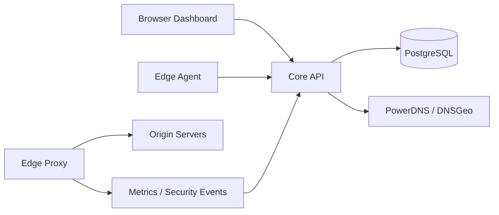

# CDNLite

Self-hosted private CDN control plane and edge platform for companies, hosting providers, internal infrastructure teams, and controlled production deployments.

[](https://github.com/vaheed/CDNLite/actions/workflows/ci.yml)
[](https://github.com/vaheed/CDNLite/actions/workflows/docs.yml)
[](docker-compose.yml)
[](LICENSE)


**Quick links:** [Documentation](docs/index.md) · [Quickstart](docs/quickstart.md) · [Architecture](docs/architecture.md) · [Security](docs/security.md) · [Deployment](docs/deployment.md) · [Roadmap](docs/ROADMAP.md)

Published OpenAPI YAML: https://vaheed.github.io/CDNLite/api/openapi.yaml

CDNLite lets operators run a private CDN-style platform with a PHP control plane, PostgreSQL state, Vue dashboard, OpenResty/Lua edge proxy, PowerDNS/DNSGeo publishing, cache and security rules, SSL workflows, analytics, audit logs, and signed edge-agent sync.

It is intended as a production-oriented private CDN foundation, not a promise that every large public CDN or enterprise identity feature is already present.

## Who Is CDNLite For?

- Private companies that want their own CDN layer for internal or customer-facing applications.
- Hosting providers exploring managed edge, DNS, WAF, and reverse proxy services.
- DevOps and platform teams building a controlled private edge network.
- CDN, DNS, WAF, PowerDNS, DNSGeo, and OpenResty learners.
- Labs, demos, and controlled production experiments that need visible operations and simple defaults.

## What CDNLite Is Not

- CDNLite is not a hyperscale Cloudflare, Fastly, or Akamai replacement.
- CDNLite is not yet a full enterprise SSO, RBAC, multi-tenant isolation, or billing platform.
- CDNLite is not a managed CDN service; you operate the core, DNS, dashboard, and edge nodes.
- Production use requires hardening, external authentication, TLS, backups, monitoring, secret rotation, and operational review.

## Feature Overview

**Control Plane**

- Domain lifecycle, nameserver verification, activation, deletion, and audit history.
- Origin management with primary and backup origins plus scheduled health checks.
- API, CLI, dashboard workflows, central job queue, readiness checks, and operational reports.
- Bounded retention pruning for raw activity, high-volume security events, DNS sync noise, and terminal SSL jobs, with dry-run-first production guidance.

**Edge Proxy**

- OpenResty/Lua reverse proxy runtime.
- Signed edge agent registration, heartbeat, config polling, metrics, and security-event ingestion.
- Per-edge tokens, HMAC signing, timestamp checks, and replay protection for edge sync.

**DNS And GeoDNS**

- PowerDNS-backed record publishing with DNS-only and proxied modes.
- DNSGeo support for health-aware private edge routing.
- Proxied apex records publish direct edge-pool answers with PowerDNS `LUA` by default, while proxied subdomains publish stable CDN CNAMEs.
- Initial managed SSL is queued asynchronously after nameserver verification for apex and wildcard hostnames.

**Cache And Performance**

- Cache settings, cache rules, purge workflows, and cache analytics.
- Page rules, redirects, response headers, and origin fallback behavior.

**Security And WAF**

- WAF rules, rate limits, IP access rules, security events, audit logs, and protection profiles.
- Dashboard security center workflows for common starter policies.

**SSL And Certificates**

- ACME DNS-01 issuance and renewal scheduling.
- Manual certificate import and SSL settings per domain.

**Observability**

- Health endpoints, edge heartbeats, edge metrics, security-event ingest, audit logs, dashboard reporting, and troubleshooting docs.

**Operations And Deployment**

- Docker Compose deployment, split deployment examples, CI smoke/e2e checks, PowerDNS diagnostics, runbooks, and stress-test tooling.

## Architecture Overview



The normal topology is the root [docker-compose.yml](docker-compose.yml). Split deployments can place the core API, dashboard, DNS services, and edge nodes on separate hosts or networks.

## Quickstart

```bash
cp .env.example .env
docker compose up -d --build
curl -fsS http://localhost:8080/health
curl -fsS http://localhost:8081/health
```

Open the dashboard at `http://localhost:8082`. Local bootstrap credentials are `admin` / `admin`; these are for local development only and must not be used in shared or production deployments.

Next steps:

- [CDN in a Minute](docs/cdn-in-a-minute.md)
- [Quickstart guide](docs/quickstart.md)
- [First configuration examples](docs/examples/index.md)
- [Production hardening](docs/production-hardening.md)

## Production And Private Deployment

For controlled production experiments or private company deployments, review [Deployment](docs/deployment.md), [Production Hardening](docs/production-hardening.md), [Security Model](docs/security.md), and [Enterprise Readiness](docs/enterprise-readiness.md).

Plan for:

- Split core, edge, and DNS topology where appropriate.
- TLS on public and internal service boundaries.
- Secret rotation for API tokens, edge tokens, database credentials, ACME credentials, and PowerDNS API keys.
- Database backups and restore drills.
- External authentication in front of the dashboard until native SSO/RBAC is implemented.
- Network segmentation so PowerDNS, PostgreSQL, and internal APIs are not exposed unnecessarily.

## Security Model

CDNLite includes a practical security foundation for private edge deployments:

- Edge requests to the core are HMAC signed.
- Edge nodes use per-edge tokens.
- Timestamp and nonce checks provide replay protection for signed edge traffic.
- The core API uses bearer token authentication for automation.
- Audit logs record operational changes.
- Default credentials are local-only bootstrap values and must be replaced before shared use.

See [SECURITY.md](SECURITY.md) for vulnerability reporting and [docs/security.md](docs/security.md) for operational hardening.

## Comparison

| Option | Best fit | Tradeoffs |
| --- | --- | --- |
| Nginx/OpenResty only | Single reverse proxy or custom edge scripts | Fast and flexible, but no built-in CDN control plane, dashboard, DNS publishing, audit trail, or edge sync workflow. |
| Public CDN vendors | Global managed CDN, managed WAF, managed edge network | Mature and highly available, but less private control and vendor dependency for routing, policy, logs, and edge behavior. |
| DIY scripts | Small one-off automation around DNS and proxy config | Simple at first, but can become hard to audit, test, roll back, or operate across multiple edges. |
| CDNLite | Self-hosted CDN control plane for private edge networks | Gives a cohesive control plane, dashboard, PowerDNS/DNSGeo, OpenResty edge, WAF, cache rules, SSL, analytics, and signed edge sync, but still needs production hardening and lacks native enterprise SSO/RBAC/billing today. |

## Maturity

CDNLite is suitable for labs, private deployments, demos, and controlled production experiments. For enterprise production, review the hardening checklist and current limitations before exposing it to critical workloads.

Current known limits include native RBAC, OIDC/SAML SSO, full multi-tenant isolation, billing workflows, signed release artifacts, Kubernetes packaging, and HA control plane documentation.

## Roadmap Preview

- RBAC and scoped API keys.
- OIDC/SAML SSO and external identity integration.
- Stronger tenant isolation and audit export.
- Prometheus metrics and Grafana dashboards.
- Helm/Kubernetes deployment and Terraform examples.
- HA control plane documentation, backup/restore automation, and edge autoscaling.
- Policy templates for WAF, rate limits, cache rules, and private deployment presets.

See [docs/ROADMAP.md](docs/ROADMAP.md) for the fuller roadmap.


## Development And Validation

```bash
docker compose config --quiet
find core -name '*.php' -print0 | xargs -0 -n1 php -l
pytest -q core/tests
cd dash && npm ci && npm run typecheck && npm test && npm run build
cd docs && npm ci && npm run docs:build
```

Smoke and e2e checks use the root stack:

```bash
docker compose up -d --build --wait
./ci/smoke.sh
./ci/e2e.sh
CDNLITE_EDGE_HEALTH_MODE=static ./ci/dns_e2e.sh
```

Run the destructive DNS stress test only against an explicitly disposable environment.

Useful operator commands include `php artisan cdn:edge:sync-config` to publish or
fetch the active edge config and `php artisan cdn:config-snapshots:prune
--keep=2 --batch=5000 --dry-run` to review bounded snapshot cleanup before
deleting old published artifacts. Snapshot rollback/history endpoints are
disabled by default because database tables remain the source of truth.

## Contributing

Contributions are welcome across docs, tests, OpenResty/Lua edge work, Vue dashboard UX, PHP control plane, security hardening, deployment examples, Kubernetes/Helm, Prometheus/Grafana, RBAC, and SSO.

Read [CONTRIBUTING.md](CONTRIBUTING.md) before opening a pull request.

## Security Disclosure

Please read [SECURITY.md](SECURITY.md). Do not publish exploit details, secrets, tokens, production hostnames, or private logs in public issues.

## License

CDNLite is released under the [MIT License](LICENSE).
