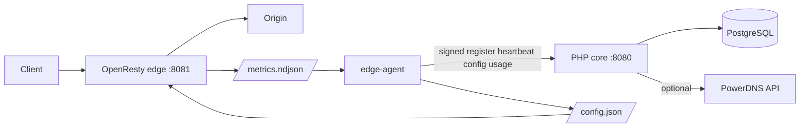
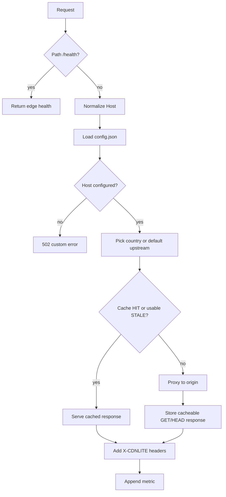
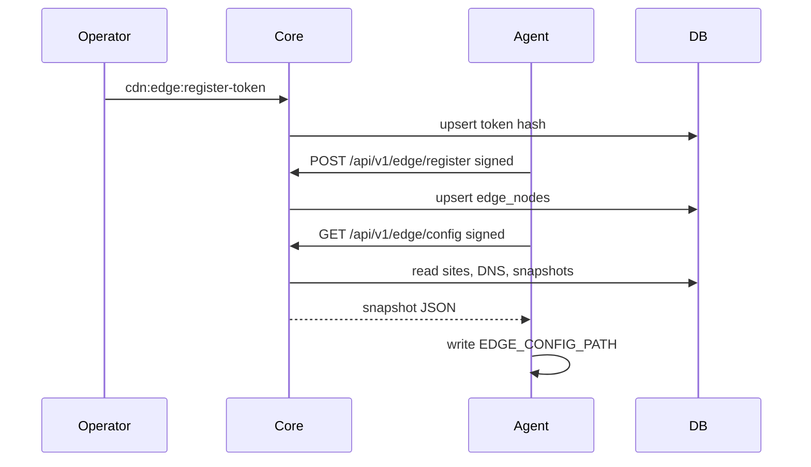
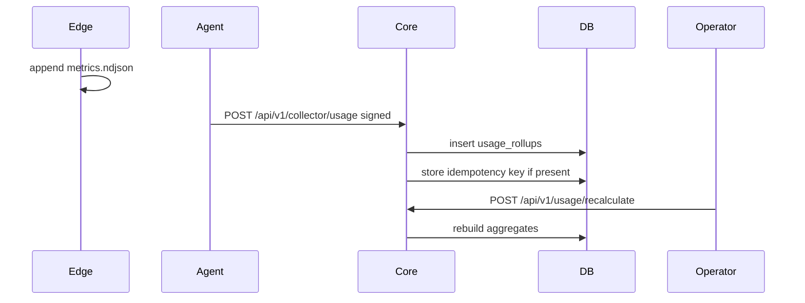

# Architecture

[Back to docs index](index.md)

## System Diagram

## Request Flow

## Edge Registration And Config Sync

## Usage Ingestion

## Failure Paths

| Failure | Behavior |
|---|---|
| Missing config | Edge loads version `0` with empty hosts. |
| Unknown host | Edge returns 502 custom error page. |
| Origin failure | Nginx serves a stale cached response when available; otherwise it maps 500/502/503/504 to custom HTML. |
| Missing edge auth | Core returns `401` and `edge_auth_required`. |
| Replay nonce | Core returns `409` and `edge_auth_replay_detected`. |
| Invalid usage bucket | Core returns `422` and `bucket_must_be_one_of_minute_hour_day`. |
| PowerDNS strict failure | API returns 502 or CLI exits non-zero. |

## Limitations And Assumptions

No dashboard, purge API, TLS automation, production scheduler, or user auth layer is implemented. Config updates are pull-based. Routing is by host, with optional country-based upstream selection from headers. The cache layer has a clean site-level `cache_rules` snapshot placeholder, but advanced purge and rule management are intentionally not implemented yet.
